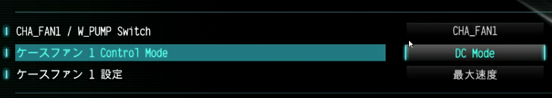
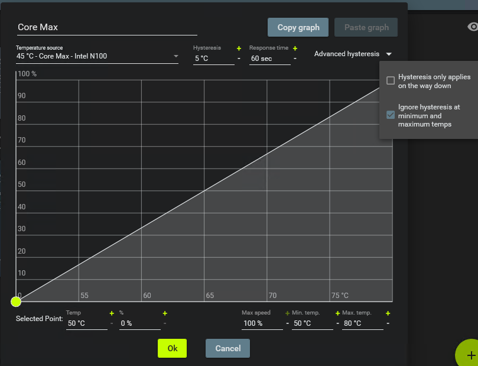

この記事は、[工学研究部 部報 第76号](https://buho.ueckoken.club/76.pdf#page=19)に掲載した記事を、無料公開に際してブログにも転載したものです。掲載時から加筆修正が含まれる場合があります。

低消費電力かつ必要十分な性能を持つCPUとして、Intel N100が有名である。主にミニPCに搭載されているが、ノートPCやデスクトップPC用マザーボードにも採用例がある。今回は、ファイルサーバ用のPCとしてN100マザーボードを導入し、セミファンレス運用を試みてみた。

## 環境

ファイルサーバPC用にASRock N100DC-ITXを導入した。N100をオンボード搭載したMini-ITXマザーボードで、この手のものでは珍しくSATAポートを2口備えている。N100のTDPは6Wと非常に小さく、N100DC-ITXではファンレス運用を想定してCPUクーラーの代わりに大きめのヒートシンクが搭載されている。ケースはATXのメーカー製PCのものを流用し、背面とHDDベイの直後にそれぞれ120 mmファンを搭載している。

このPCは自室に設置するが、一般の家庭なので空調をつけっぱなしにするわけにはいかず、さらに無駄に日当たりがいいため、自分が外出中の夏の昼間は人間が存在できない程度の高温になる。さすがに40 °C近くある空間でのファンレス運用は厳しいため、必要なときにのみファンを回すセミファンレス運用を試みる。

## ファンの制御方式

PCファンの制御方式には大きく分けて電圧制御とPWM制御の2種類ある。電圧制御はそのままの意味で、電源電圧を変えることでファンの回転数を制御する。一方、PWM制御では、電源は常に12 Vを与え、それとは別にPWM信号を送ることで、ファン側で回転数が制御される。

PWM制御はほとんどすべてのマザーボードで利用できるが、ファン側でも対応している必要がある。電圧制御はPWM制御に対応していないファン(3ピンファン)でも利用できるが、マザーボードによっては対応していないことがある。また、制御するうえで注意しなければならない点がいくつかある。

基本的にはPWM制御のほうが扱いやすいが、セミファンレス運用をしたいとなると話が変わってくる。PWM制御では30%未満での挙動は「30%での回転数以下」としか規定されておらず、ほとんどの場合は30%での速度を維持する。つまり、完全停止まで持っていくことはできない。しかし、電圧制御であれば、電源供給を断ってしまい強制的にファンを止めることができる。

## 制御の設定

### 制御方式の設定

幸いなことに、N100DC-ITXは電圧制御に対応している。UEFIの設定画面で「DC Mode」を選択することで電圧制御となる。回転数の制御もUEFI上から行うことができるが、今回はOS側で制御したいため、こっちの設定は最大速度固定にしておいた。

ちなみに、[以前](/blog/20240010-6pin-fan-pwm/)紹介したように、PWM制御にしか対応していないマザーボードでも、PWM信号によって電源をスイッチングする簡単な回路を組めば、電圧制御と同じようなことができる。

### 制御アプリの設定

設定ができたら、Windows上に制御アプリをインストールする。今回はFan Controlを採用した。(あまり一般名詞を固有名詞として使うのは良くないと思うのだが……。)wingetに登録されているため、`winget install FanControl`でインストールできる。初回起動時に指示値とファンの回転数を対応させるキャリブレーションが提案されるが、時間がかかるわりにあまり有益でないのでスキップして問題ない。どの出力がどの回転数入力に対応しているかのみ設定すればよい。

電圧制御特有の設定として、「Start %」と「Stop %」がある。Start %は止まっているファンが始動するために必要な出力で、Stop %は回っているファンが回転を維持できずに停止してしまう出力である。たとえば、始動には50%の電圧が必要だが、30%までは下げても回転を維持できるというファンが存在するとき、それぞれ設定しておくと、30-50%の範囲の指示がされたときに50%を2秒間出力して始動させたあと、指定された出力で運転を続けるという動作をしてくれる。また、30%以下の指示のときには0%に切り捨てることで、ロックしたモータに電流を流して損傷させることを防いでくれる。なお、[Intelの仕様書](https://web.archive.org/web/20251012095343/https://www.intel.com/content/dam/support/us/en/documents/intel-nuc/intel-4wire-pwm-fans-specs.pdf)によれば、PWM制御ではこのような操作をファン側で行うよう定められている。

手動設定を有効にして、回転数を見ながら出力を上げたり下げたりすることで、このような出力値を見つけて設定していく。Start %に関してはとりあえず100%としておいても問題はない。本来はこの値も自動キャリブレーションできるはずなのだが、あまり正しい値にならなかった。

### 制御内容の設定

以上の設定でファンを回したり止めたりすることができるようになったため、あとはいつどのくらい回すか回さないかを設定する。制御の基準は無難にCPU温度とする。まず、空調が効いていてファンを回していないときのCPU温度を確認する。負荷が平常なときには45 °Cから50 °C程度、CPU負荷を100%にしているときの温度は70 °C前後であった。これをもとに、50 °Cで0%、80 °Cで100%という単純な制御カーブ(直線だが?)を図のように作成した。

このままでは空調が効いていても負荷がかかるとすぐにファンが回ってしまうため、応答時間を60秒と長めに設定し、また、温度の低下時のみヒステリシスを適用する設定を外すことで、自然放熱を待つようにした。さらに、最大温度を80 °Cに設定し、最大値と最小値でヒステリシスを無視する設定を有効にすることで、高温になりすぎたときには即座にファンを回すようにした。

制御対象はケースファンのほか、HDDの背後のファンもCPU温度に連動して回すようにしている。本当はHDD温度に連動させたいところだが、HDDの温度を取得しているとHDDがアイドル時にもスリープしてくれず、そのせいで騒音と発熱が増えるという本末転倒な状態になってしまうためである。アクセスがあるときのみの稼働なら灼熱の部屋でも過熱することはないようなので、ひとまずこれで妥協しておく。

## スタートアップ設定

Windowsの起動とともにファン制御を開始してほしいので、Fan Controlをスタートアップに登録する。アプリ内の設定から行えるが、電源を入れてもログインせずに放置するサーバ運用のPCにおいては、これだけでは不十分。このスタートアップは「任意のユーザーのログオン時」にタスクスケジューラによって実行されるようになっているため、ログインしなければ実行されない。`netplwiz`などを用いて自動ログインを設定しておく。また、ログインしたままではあまり気持ちよくないので、`rundll32.exe user32.dll, LockWorkStation`へのショートカットをスタートアップフォルダ(`shell:startup`)に置いて自動でロックされるようにしておく。なお、タスクスケジューラでは「スタートアップ時」をトリガーにすることもできるが、この手のGUIアプリはログイン後でないと正常に実行できないので使えない。

## N100はいいぞ

N100DC-ITX導入前はSandy Bridge-Eのメーカー製PCをファイルサーバとしていたが、電源ファンもCPUファンもケースファンも爆音を発していたのでとても自室でつけっぱなしにすることができず、HDDにアクセスしたいときのみ電源をつける面倒な運用をしていた。N100マザボに置き換えてセミファンレス化することで、平時は無音で常時起動できるすばらしいPCになった。ちなみに、N100DC-ITXの電源はDCジャックで、ELECOMのPDトリガーケーブルで65 WのPD充電器から給電している。当然音はしない。

N100はこのようにファンレス運用できる低消費電力のCPUで、性能も個人的なファイルサーバ程度であれば余裕である。さらに、軽いブラウジングも試してみたところ、これもストレスなく行うことができ、サーマルスロットルングが起きるほど発熱することもなかった。さすがにゲームをしようと思うと厳しいが、うるさく熱くせずに軽い作業をしたいのであれば、かなりよい選択肢といえる。SATAやPCIeなどの拡張性を求めないのであればミニPCがちょうどいいかもしれない。工研でも共有PCとして導入するとかなんとか。

## 今後

N100DC-ITXは部報のネタにすることを見込んで導入したものではあるが、当初はファン制御について書く予定ではなかった。Mini-ITXマザーボードは170 mm四方とコンパクトであり、N100DC-ITXでは電源装置も要らないため、3Dプリンタ(工研のP1Sでは256 mm立方刷れる)でケースを自作しようと考えていた。欲張って120 mmファンをCPU用とHDD用とで2つ横並びに配置しようなどと試みたが、16 mmしか残らない余白ではなにもできず挫折した。とりあえずATXケースにぶちこんで運用してみた結果生まれたネタが今回の記事である。

実際に運用してみて、他が静かになるとHDDの回転音が意外とやかましいのでスリープは続行したほうがよい、そのためHDDの個別冷却は不要、つまりファンは1つで十分、という知見を得られたため、ファンを1つにしてケースの設計を再度試みてみるのもいいかもしれないと思う。HDD2台をねじこむだけでも大変だが……。
