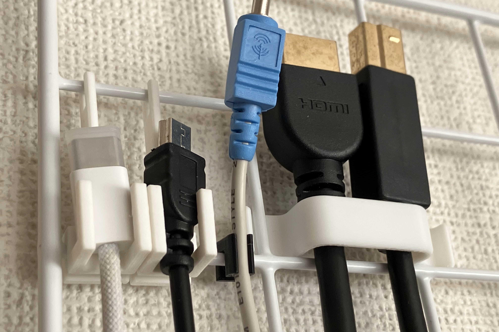
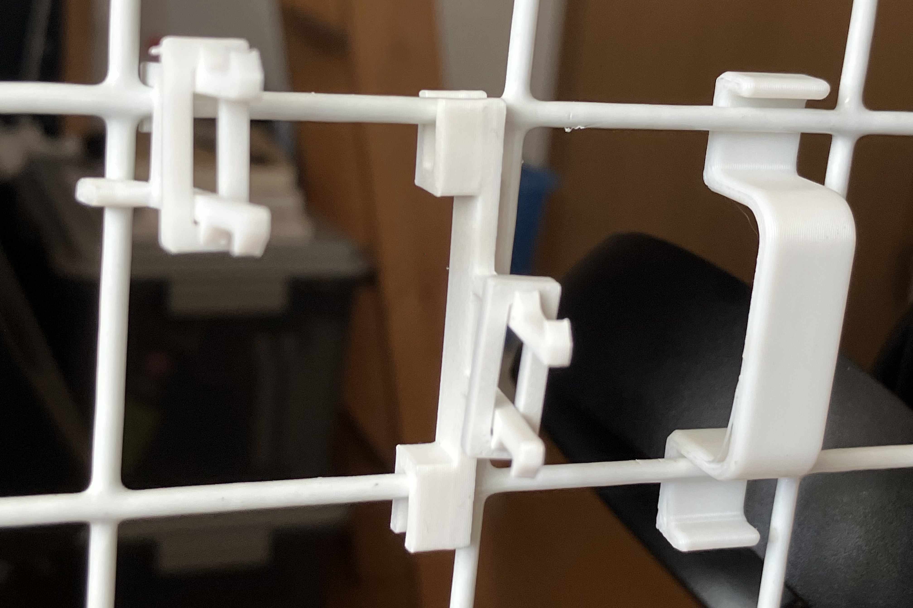
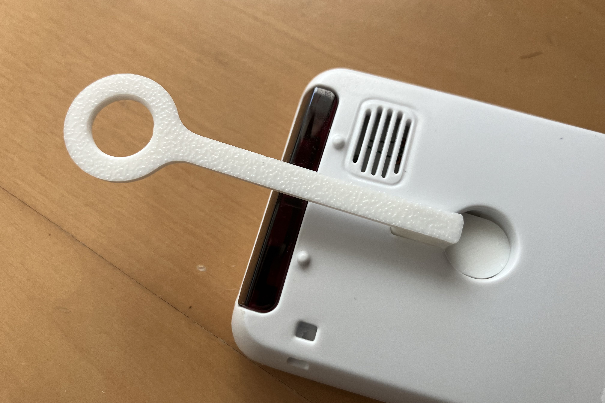
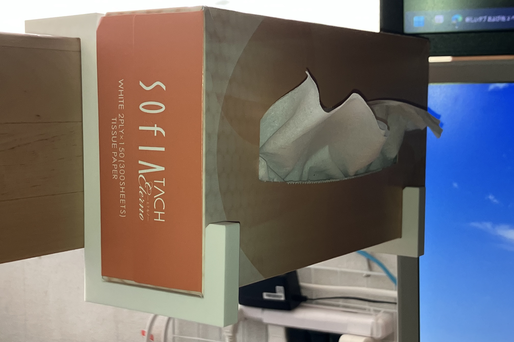
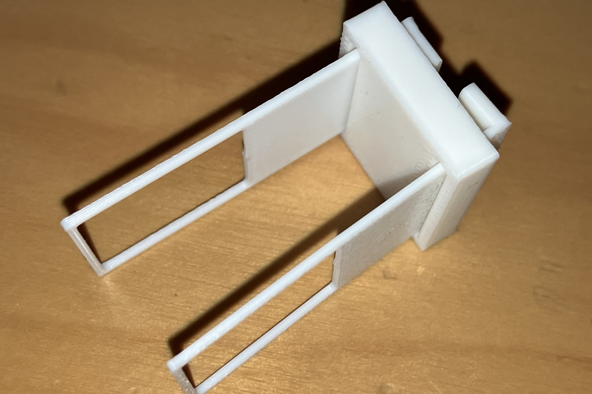
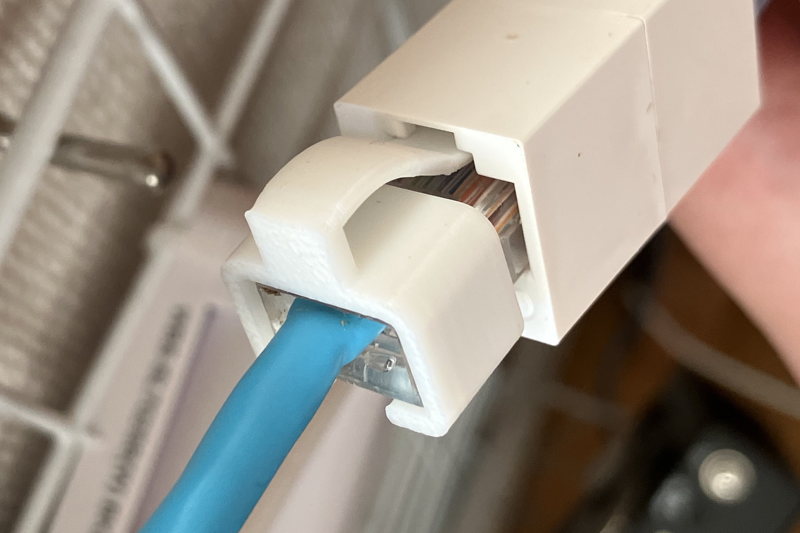

この記事は、[工学研究部 部報 第77号](https://buho.ueckoken.club/77.pdf##page=16)に掲載した記事を、無料公開に際してブログにも転載したものです。掲載時から加筆修正が含まれる場合があります。

工学研究部の特徴的な機材として、3Dプリンタが挙げられる。謎の船のオブジェを作って満足するとか、ビックリドッキリメカを作るくらいしか用途がないように思われがちだが、実用的な日用品を作ることにも大いに役立つ。今回は、自分が3Dプリンタで作った日用品を紹介する。

## 3Dプリンタとは

3Dプリンタとは、比較的手軽に立体物をCADデータをもとに現実世界に召喚することができる~~魔道具~~工作機械である。その手法には色々あるが、現在個人用途で主流なのは溶かした樹脂を積み重ねて造形するFDM方式。

FDM方式では、下から上に積み重ねる都合上、下から支えられていない形状(特に片持ち梁)を作りにくいという制約がある。サポート材と呼ばれる支えの部位を作ることで対処できるが、取り除く手間や材料の無駄が発生する。今回紹介する物品もFDM方式の3Dプリンタで造形したものであり、この点を考慮して設計している。

## ケーブル収納

初めて3Dプリンタを使って作ったのは、使っていないケーブルを百均のワイヤーネットに掛ける形で保管するための部品である。まっすぐ掛けることで、絡まらず、出し入れしやすく、一覧性よく保管できる。

当初はコネクタ部をひっかけるようにしていたが、形状によってはうまく掛からなかったり、重いものには耐えられなかったりした。次の世代では、ケーブルにフックをはめ込む形にしたが、ケーブルの太さを正確に測定し、さらに公差を考慮して設計する必要があり、手軽さが犠牲となった。最終的には、次に紹介するような配線整理に使うものと兼ねる形にした。

## 配線整理

使用中の電源コードやLANケーブルなどの整理にも活用できる。こういったケーブルは針金や可逆結束バンドなどでワイヤーネットにくくりつけることで整理していたが、脱着が面倒だったりしてあまり快適でなかった。最初は使っていないケーブル同様ひっかけるようにしていたが、ケーブルには上方向に力がかかる場合もありあまり適切でなかった。その次は穴の両側にかみこんで固定するようにしたが、脱着が面倒になった。最終的にはかぶせてはめ込む形状とし、これは使っていないケーブルの整理にも使えるものとなった。

また、スイッチングハブを縦向きにワイヤーネットにくっつけたかったが、ギリギリ重力に負けてしまったので吊るして支える部品も作った。

## ケーブル携帯

ケーブルには家で常設するもののほかに持ち運ぶものもある。束ねて鞄に入れるだけでは跡がついたり引っかかったりするので、ケーブルを丸く格納できる容器を作った。外壁を一層として連続的に造形する方法を用いてみたところ、収縮してべこべこになったり少し使うと裂けたりしたが、使えないことはないくらいになった。

## ピンセット立て

工研部室ではピンセットを普通のペン立てに立てていたが、ピンセット同士が絡まって取り出しにくいことが多々あった。そこで、仕切りのついたシンプルなピンセット立てを作った。先が曲がったピンセットのために2コマの領域も用意した。

## リモコン掛け

エアコンのリモコンがよくあるネジ山にひっかける穴が空いているタイプなのだが、このためだけにネジを壁に打ち込むのは面倒である。画鋲のように容易に設置できるフックが百均に存在するので、それにリモコンをかけられるようにした。

## ティッシュ箱、ACアダプタフック

箱ティッシュをロフトベッドの梁部分に吊るすためのフックのようなものを作った。ぴったりのサイズにでき、取り出すときに動かないのでとても使いやすい。同様にモニタのACアダプタの箱部分を吊るすためのものも作った。

## キートップ引抜工具

キーボードのキートップを引き抜くための工具を作った。[市販のもの](https://www.diatec.co.jp/products/det.php?prod_c=706)には金属ワイヤが使われているが、細い樹脂でも意外と大丈夫だった。サポート材が不要となるようパーツを分けたところ、可動域が広がるという利点もあった。

## LANケーブルのツメ

LANケーブルのツメが折れて固定できなくなることがまれによくある。そんなLANケーブルに被せてツメの代わりになることで[対処するパーツ](https://www.sanwa.co.jp/product/syohin?code=ADT-RJ45SOS-10)があるが、3Dプリンタでも作ることができる。モデルは自作ではなく[配布されているもの](https://makerworld.com/en/models/446389-ethernet-rj45-repair)を用いた。

## 一家に一台3Dプリンタ

工研では、FDM方式の3DプリンタとしてBambu LabのP1SとA1 miniを導入している。自分の入部目的の一つはこの3Dプリンタを使用することであった。もちろん工研の3Dプリンタを借りてもよいが、日用品は自宅で欲しいときに作れるのが理想である。したがって、人類は一家に一台3Dプリンタを持つのがよいとされる。自分も途中からA1 miniを導入している。

でも、お高いんでしょう? 難しいんでしょう? と思われるかもしれないが、技術の進歩により、3Dプリンタは安価かつ特別な知識なしで使えるようになってきている。Bambu Labの製品はその最たるもので、各種調整が自動化されていることにより、使用するための手順が大幅に簡略化されている。従来の世話の焼ける代わりにカスタマイズ性の高い3Dプリンタを好む人も存在するが、道具として使うのであればBambuのようなものが適している。お値段はセールであれば最安3万円から、通常時でも5万円からで、激安と言わないまでも十分現実的である。

Bambu Labには比較的安価なA1シリーズと、「囲い」があり使える材料の多いP1, P2シリーズがあり、後者が上位機種とされている。しかし、上位機種でも古いP1シリーズは、後発のA1シリーズと比べると劣る部分が多々ある。これについては別の記事で詳しく紹介しているので、そちらを参照されたい。

<OGPCard url="https://dg7.dev/blog/20250010-dont-buy-p1s/" />