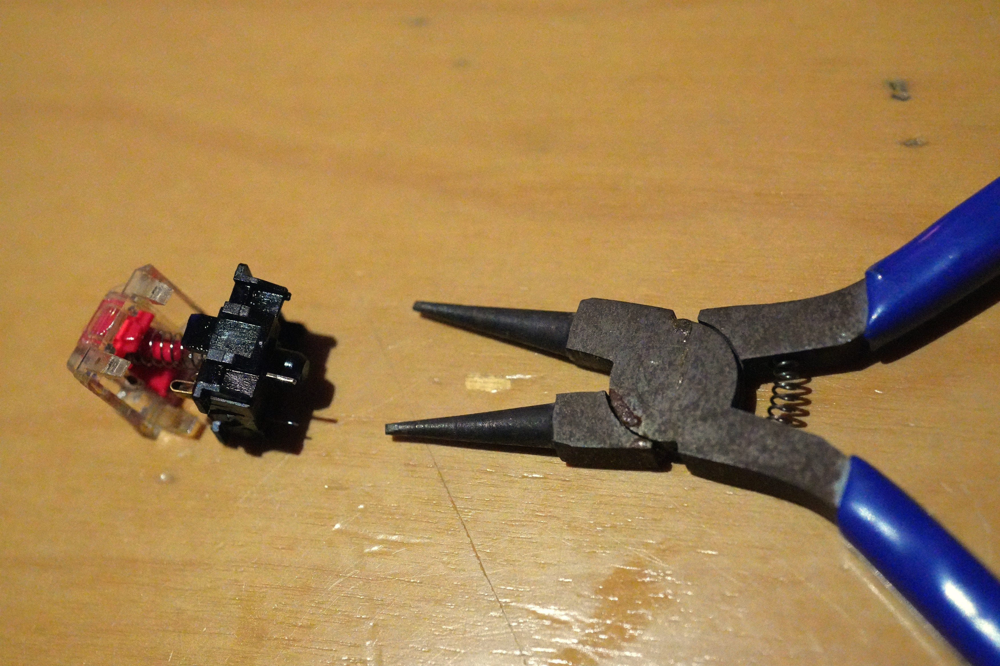
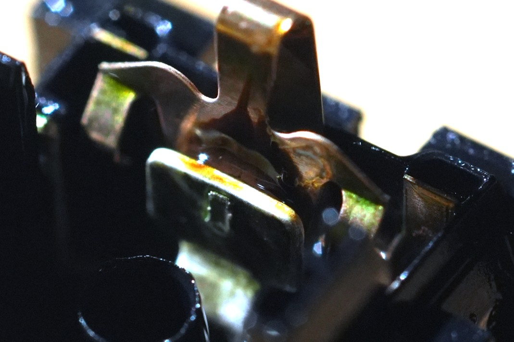
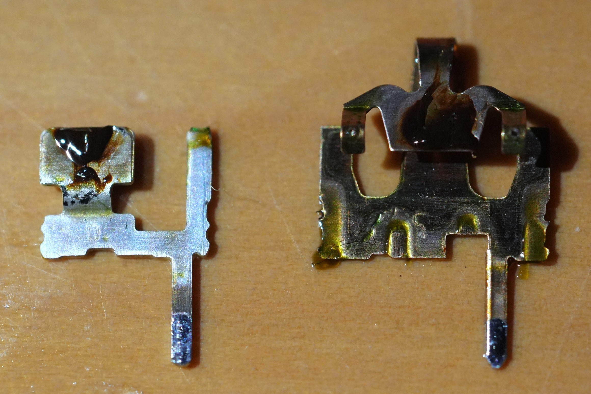
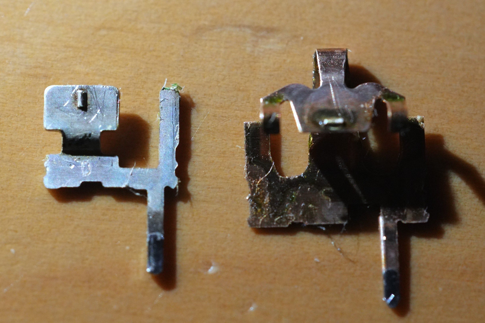

自宅でPCをいじるときはメカニカルキーボードを使っているのだが、この手のキーボードはしばらく使っているとチャタリングが発生することがしばしばある。これの対処には接点復活剤(専ら[呉工業のもの](https://www.kure.com/product/k1424/))を使うのが一般的なようで、自分もそれに倣っていた。しかし、使い続けていたところ問題が悪化し、どうやらそれが逆効果だったらしかったため、分解清掃により解決を図るとともに、本来取るべきだった対処方法について検討してみた。

## 症状

メカニカルキーボードの特定のキーでチャタリングが発生していたため、何も考えずに軸と筐体の間に接点復活剤を流し込んだ。症状が改善するまで使用したところ「流し込む」と表現するに値する量になっていた。かなり雑だが、ｲﾝﾀｰﾈｯﾂに上がっている使用例もだいたいそんな感じだったし、少なくとも流し込んだ直後は症状は改善されていためよしとした。しばらくするとまたチャタリングが再発するようになったが、「効果は一時的」というのも聞いたことがあったため、同じことを何度か繰り返していた。

ある時から、チャタリングどころではない不具合が発生し始めた。しばらく放置した後の最初の数回は無反応となり、一旦反応し始めるとその後は普通に動作する、という状態になってしまったのである。再び接点復活剤を流し込んでみても症状は改善されない。何度か連打すれば使えるようになるため騙し騙し使っていたが、さすがに不便なのでキースイッチの交換(あまり使わないキーとの入れ替えor購入)を検討していた。

## 分解

ホットスワップ非対応のキーボードで、キースイッチの交換にはキーボード自体の分解が必要になるため、そのついでにキースイッチの分解もしてみることにした。不具合の原因を推察しようにも、スイッチの電気接点などの構造すら知らなかった(軽く調べた限りでは十分な情報が得られなかった)ため、構造の直接の確認も行う。

まずは当該スイッチのはんだ付けを外し、キーボードの基板から取り外す。アリエクで購入した[はんだシュッ太郎のパチモン](https://ja.aliexpress.com/item/1005008034695432.html)が役に立った。無くても新鮮なはんだを追加してから吸い取り線とかでも十分いける。

キースイッチ自体の分解には、ツメで固定されている上下の筐体を分離する必要がある。ツメは4ヶ所あり、これを外すと軸方向のコイルばねの力で上側の筐体と軸とが一緒に持ち上がる。ばねをなくさないように注意。最初は先端を加工したプライヤ(昔レンズを分解する際に使った)を使って2ヶ所ずつ外した。先の細いピンセットやノギスなどでも外せると思われる。3Dプリンタがあるなら、[分解用の工具](https://makerworld.com/en/models/418904-mx-and-kailh-switch-opener)を印刷すると便利である。[部品を1セット置いておけるタイプ](https://makerworld.com/en/models/1089472-mx-switch-opener-and-luber-station)もあったが、寸法が微妙に合わなくて片方ずつしか開けなかった。[複数同時に作業できるもの](https://makerworld.com/en/models/744917-keyboard-switch-opener-lube-plate-disassembly-and)もあり、これの右上部分はちゃんと使えた。

接点の一方は板ばねの構造となっており、普段は縮んだ状態になって開放されていて、軸を押下するとばねが伸びて接点が閉じる、という構造になっている。接触部分には出っ張りがあり、点で接触することで圧力を高めていると考えられる。筐体に組込まれた状態では見辛いので、関係する部品のみを並べて動きを再現した写真を以下に示す。

")

。軸は本当は下に逃げる。")

分解した直後の状態が以下の写真であり、接点の周囲に黒く粘性の高い物体が付着していた。具体的に何なのかは断定できないが、内部の摩耗によって発生する汚れや外部から入る汚れが、液体のまま残った接点復活剤と混ざってこのような物体を形成したものと考えられる。この物体が寒くなったことにより硬くなり、数回押下して剥がれるまで導通しない、という状態になっていたものと思われる。

金属部品は、基板側の足を固いものを使って押し込むことで筐体から取り外すことができた。今回は問題なかったが、あまりはんだが残りすぎていると外せない可能性がある。

プラスチック部分はぬるぬるべたべたになっていたしなんなら液体が普通に存在していた。正常な状態でもグリス等である程度ぬるぬるしているが、その比ではなかった。一応、溶けたり変形したりはしておらず、「プラスチックにかかっても安心です」という売り文句は嘘ではなかったらしい。

## 清掃

金属部品は付着している物体をティッシュで拭き取った後、若干ばねを開く方向に力を加えておいた。キムワイプがなくティッシュで拭いたら繊維がけっこう出てきて悲しくなった。接点復活剤の再使用は一旦しないことにした。

プラスチック部品は水洗いして乾燥させた。グリス等も落ちてしまうため正常なものよりぬるぬる感がなくなってしまったが、余計な成分が残留しているよりはマシだと思われる。

## 組立

組立は分解の逆の手順で行う。iFixitならその一言で済まされそうだが、いくつか気をつける点がある。

外した金属部品を戻すのは難しいが、筐体の穴に端子の位置を合わせることを意識するとなんとかなる。このとき、穴の付近に指を置かないように注意する。勢い余って指にぶっ刺さるとひどいことになるので注意(一敗)。

筐体を閉じる際は、下側の筐体にばねを乗せ、軸と上側の筐体をまとめてはめるようにすると楽。

はんだ付けし直す前にテスタでスイッチとして機能しているか確認しておくとよい。また、複数のスイッチを同時に外した場合は、はんだ付けし忘れないように注意(一敗)。1つづつはめて都度はんだ付けすれば忘れようがないことに記事を書きながら気づいた。

## 正しい対処方法

結論としては、キースイッチの不具合の対処として、外側から接点復活剤を流し込むことは避けるべきと考えられる。分解せずに済むのは楽だし、吹いた直後は改善が見られるので有効に思われがちだが、構造上接点まで届かせるには大量に流し込む必要があり、今回のような余計な問題を引き起こす可能性があるうえ、そもそも原因への対処になっていなさそうなためである。

どうしても分解できない場合は、接点復活剤は使わず、エアダスタを吹き込んだり、無水エタノールをなんとかして接点まで到達させ、何度か連打したうえで、十分乾燥させる、等が比較的安全だと思われる。

多少面倒でもキースイッチを取り外し、分解して対処するのが望ましいと思われる。そういう意味では、ホットスワップ対応キーボードは保守性の面でも優れていると言える。

接点復活剤が原因への対処となっていないと言えるのは、不具合の原因がほとんどの場合接点の汚れである(らしい)からである。この場合は、アルコール洗浄や乾拭きなどで汚れを取り除くのが適切な対処となる。接点復活剤にも一応洗浄成分はあるが、ほかの余計かつ不揮発性な成分が多いため最適ではない。

もし原因が接点の酸化であれば、接点復活剤の出番となる。ただし、酸化は急速に進行するものではなく、また、使用中は接触圧によりある程度破られると考えられるため、新しめで普段使いしているキーボードであれば、あまり可能性は高くないと思われる。もし原因であったとしても、接点復活剤を外側から流し込むのではなく、分解して接点のみに適量を塗布することが求められる。

接点の摩耗で表面性状が悪化している場合も、接点復活剤が適している。ただし、接点はほぼ擦れないような機構であり、また、安物でない限り通常の使用で問題にならない程度の耐久性は確保されているはずなので、これが問題となる可能性は低いと思われる。

軸に強い力を与えて板ばねが塑性変形したなどの理由により接触圧が低下していることが原因であれば、接点を取り外して若干開く方向に調整することで改善できると考えられる。あまり圧力を高めすぎると接点が摩耗しやすくなるなどの弊害があるかもしれない。

そもそも、不具合が起きること自体を防げるならそれに越したことはない。汚れが主要因であることを考えると、こまめにキーボード表面を掃除し、汚れがスイッチ内部に入り込む前に除去するのがよいと考えられる。

## あとがき

先例が存在するとはいえ、接点復活剤を流し込むという行為はあまりに軽率であった。不具合の対処は、構造と原因を理解したうえで行うべきである。今回の「結論」も、断定で記していないことからお察しかと思うが、きちんと分析、調査したわけではない。今後不具合が発生したときに清掃だけで解決すれば裏付けとなると思われる。