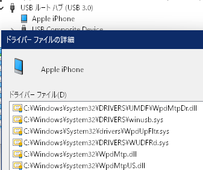
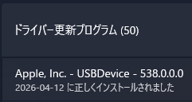
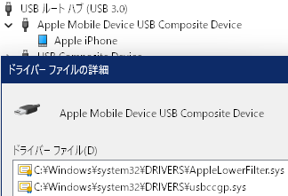
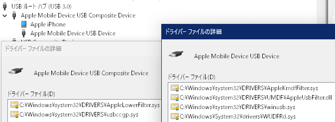
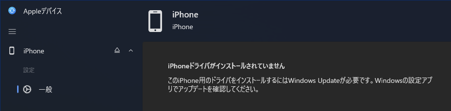
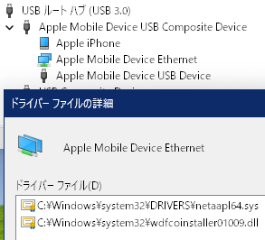

電気通信大学のキャンパス内では電気も通信もろくに使えないことはよく知られている。また、ただでさえ貧弱な学内Wi-Fiが妨害されてしまうため、(無線による)テザリングはやめろとのお達しがあった。となれば、USB接続によるテザリングを使う必要が生じるのだが、iPhoneのUSBテザリングはただ素のWindowsに接続しただけでは使えない。[公式ドキュメント](https://support.apple.com/ja-jp/111785)を頼りたいところだが、Windowsに関する言及はない。iPhone側の画面にもUSBで繋げとしか表示されない。ネットに散乱する記事はiTunes時代の古文書かすでに環境が整っていた場合の話かAIの落書きかしか見当たらない。参考になる文献が存在しないので、令和最新版iPhoneにおいてUSBテザリングには何がどう必要なのかを自分で整理してみた。

## USBテザリングの使い方

結論を先に述べると、以下の操作でUSBテザリングが使えるようになる。上2つは順不同だが、最後の1つは上2つの後でなければならない。

- iPhoneを接続してWindows Update、再起動を要求されたら刺し直し(再起動は多分不要)
- 「Appleデバイス」アプリをインストール(Microsoft Store版で可)
- インターネット共有が有効な状態で再度Windows Update

アプリのインストールもWindows Updateもインターネット接続が必要である。しかし、テザリングを使いたいのは専らインターネット接続がほかにないときであるため、Wi-FiやBluetoothなどUSB以外のテザリングが使えない場合、これらは事前に準備しておく必要がある。

なお、Store版でないiTunesのインストールを勧める記事が目立つが、iTunesは設計が古く挙動がまともでないうえに、特にStore版でないものは[余計なものをボコボコ入れてきて](https://support.apple.com/ja-jp/102018)アンインストールもまともにできないので触らないほうがよい。

## 初期状態

初期状態では、iPhoneは「Apple iPhone」という名の単一のMTPデバイスとして認識される。

## iPhone自体のドライバ

この状態でWindows Updateを行うと、`appleusb.inf`がインストールされる。これにより、ルートに現れるのは「Apple Mobile Device USB Composite Device」に変化し、「Apple iPhone」はその下にぶら下がるようになる。インストール後に再起動を要求されるが、実際は刺し直すだけで認識されるようになる。

なお、このドライバはiTunesにも同梱されている様子はない。インストール中にどこかから拾ってくる可能性もあるが、検証のために触る気にもならないので謎のままにしておく。

## Appleデバイスアプリ

iPhone自体のドライバがあり、かつ、Appleデバイスアプリに含まれる`AppleMobileDeviceProcess.exe`が動作していると、「Apple Mobile Device USB Composite Device」の下に追加で「Apple Mobile Device USB Device」が現れる。

なお、Appleデバイスアプリ自体にはドライバは含まれておらず、先述のドライバがない状態でインストールしても認識に変化はない。また、アプリを起動するとWindows Updateを促される。

さらに、`AppleMobileDeviceProcess.exe`が動作していない場合は「Apple Mobile Device USB Device」は現れない。通常はスタートアップに登録されるため起動した状態になっているはずだが、何らかの理由で動作していない場合はAppleデバイスアプリを開くと起動する。

iTunesのこれに相当するものはサービスとして動作するっぽいが、両方入れたらどうなるんだろうか……。

## USBイーサネットのドライバをインストールする

`AppleMobileDeviceProcess.exe`が動作しているかつiPhoneでインターネット共有が有効になっている状態だと、追加で「AppleUSBEthernet」が現れる。この状態でWindows Updateを行うと、`netappl64.inf`がインストールされ、表示名は「Apple Mobile Device Ethernet」になる。

なお、このドライバは通常版iTunesに同じバージョンのものが同梱されている。7-zip等で`iTunes64Setup.exe/AppleMobileDeviceSupport64.msi/`を覗けば転がっている。ストア版は知らん。

## あとがき

ネットに繋がるようにするためにはネットが必要です!←何を言ってるんだお前は

AndroidのUSBテザリングはWindows標準ドライバで使えるのだから、iOSもそれくらいできるようにしてくれ……。